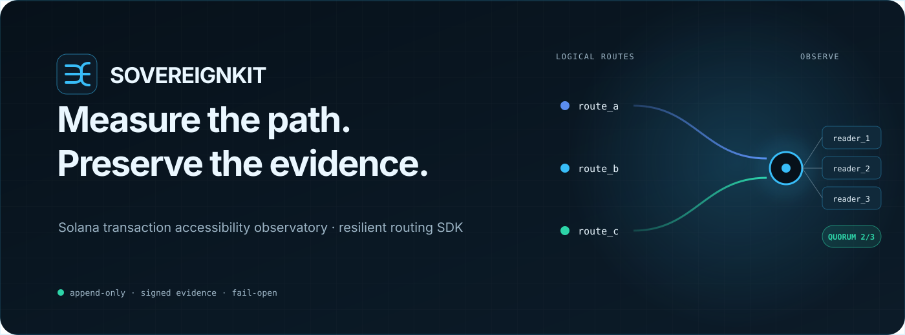
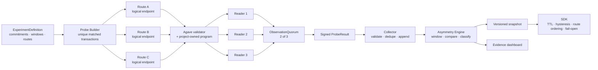
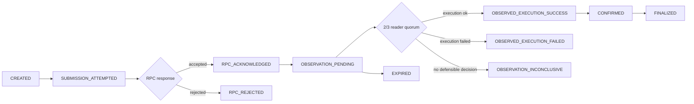
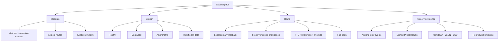
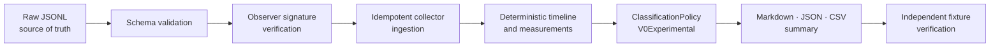

<p align="center">
  
</p>

<p align="center">
  <a href="https://sovereignkit-observatory.samuel-rramos.chatgpt.site"></a>
  <a href="#-reproduce-the-evidence"></a>
  <a href="docs/architecture.md"></a>
  <a href="docs/methodology.md"></a>
  <a href="docs/roadmap.md"></a>
</p>

<p align="center">
  
  
  
  
  
  <a href="LICENSE"></a>
</p>

> **Solana can remain healthy while a user's path to Solana fails.** SovereignKit measures that path, separates RPC acknowledgment from ledger evidence, detects reproducible route asymmetry, and gives applications a bounded way to route around failure.

## The project in 30 seconds

SovereignKit is open-source infrastructure for **measuring, explaining, and routing around Solana transaction-accessibility failures**. It combines a controlled experiment, signed observer evidence, an append-only collector, an experimental asymmetry classifier, a versioned intelligence feed, a fail-open SDK, and a [public read-only evidence dashboard](https://sovereignkit-observatory.samuel-rramos.chatgpt.site).

The 2m48s English walkthrough is available in the
[hackathon demo release](https://github.com/caiomodesti/SovereignKit/releases/tag/hackathon-demo-v0.1).
Its Remotion source, narration script, thumbnail, captions, and reproduction
commands are versioned in this repository.

| If you are… | SovereignKit helps you… |
|---|---|
| a wallet or protocol team | distinguish an RPC response from real ledger observation |
| a trading or custody system | fail over within a local route policy without trusting a stale feed |
| an RPC or reliability engineer | reproduce broad degradation versus class-selective behavior |
| a researcher | inspect raw evidence, statistical units, windows, assumptions, and claim limits |

**Current boundary:** v0.1 is a controlled proof plus a narrowly scoped Devnet integration validation—not a public provider-ranking service, a censorship oracle, or a decentralized observer network. Sprint 10 validates one real finalized Devnet lifecycle while explicitly not treating Devnet as the statistical proof or a Mainnet performance proxy. No public hosted feed or decentralized observer network exists yet.

## Why this exists

Most transaction telemetry collapses three different facts into one vague idea of “success”:

```text
RPC accepted the request  ≠  the ledger observed execution  ≠  the transaction finalized
```

SovereignKit preserves those distinctions. `RPC_ACKNOWLEDGED` **never means landing**. A route that accepted submission cannot, by itself, decide that the transaction was processed. Ledger evidence comes from an explicit observation quorum.

## Proof already established

The accepted controlled experiment is deliberately narrow and reproducible.

| Evidence | Accepted result |
|---|---:|
| Matched program pairs | **10** |
| Unique transaction signatures | **20** |
| Compute units per declared class | **510 / 510** |
| Signed statistical units retained | **600** |
| Observer signatures reverified | **600 / 600** |
| Logical readers per observation | **3** |
| Quorum | **2 / 3** |
| Required scenarios distinguished | **4 / 4** |
| Deterministic tests on accepted `main` | **84 / 84** |

The evidence is `LIMITED` at `n=30` per eligible cell. All three local readers share one validator and host, so agreement demonstrates **logical redundancy**, not operational infrastructure independence.

<details>
<summary><strong>What the four controlled scenarios proved</strong></summary>

| Scenario | Controlled intervention | Expected classification | Observed distinction |
|---|---|---|---|
| `HEALTHY` | no route-specific fault | all routes healthy | baseline behavior remained separable |
| `DEGRADED` | general degradation on one route | one degraded route | both transaction classes worsened together |
| `ASYMMETRIC` | selective rejection of `PROGRAM_X` | one asymmetric route | matched control and program class diverged |
| `INSUFFICIENT_DATA` | inadequate eligible measurements | insufficient data | classifier refused to overclaim |

Classification consumes persisted definitions and measurements only. Proxy modes and scenario labels are not classifier inputs.
</details>

## System map



## Transaction lifecycle

Every timeline is derived from immutable raw events—not assigned by a test harness.



## Mental model



## Architecture by responsibility

| Layer | Package / surface | Responsibility |
|---|---|---|
| Telemetry Core | `@sovereignkit/telemetry` | append-only events, deterministic timelines, Solana submission and observation adapters |
| Probe Engine | `@sovereignkit/probes` | unique paired transactions, declared classes, observer identities, signed results |
| Hostile Proxy | `@sovereignkit/hostile-proxy` | loopback-only pass-through, selective rejection, and precommitted degradation |
| Collector | `@sovereignkit/collector` | runtime validation, observer allowlist, idempotency, durable local ingestion |
| Analysis | `@sovereignkit/analysis` | explicit windows, missingness, Wilson intervals, peer baselines, experimental classification |
| SDK | `@sovereignkit/sdk` | bounded primary/fallback routing, snapshot validation, TTL, hysteresis, developer override, probe-informed route ordering |
| Dashboard | `@sovereignkit/dashboard` | static, read-only rendering of accepted evidence and provenance |

### Contracts that do not move silently

- A `Route` is a logical submission perspective—not a promise of one physical machine or network path.
- `TransactionClass` is declared by the probe definition; v0.1 does not attempt generic semantic classification of arbitrary transactions.
- Every `route × transaction_class × probe_index` has its own transaction and signature.
- Comparable probes share an explicit commitment and send/preflight configuration.
- The primary statistical unit is `experiment × observer × route × transaction_class × probe_index`.
- The first classifier is named `ClassificationPolicyV0Experimental`; it is not presented as universal.
- Evidence is described with `evidence_strength`, not uncalibrated confidence.
- Stale or unavailable intelligence fails open to the application's local primary/fallback policy.

## Quick start

### Requirements

| Tool | Pinned / supported value |
|---|---|
| Node.js | `22.17.0` |
| pnpm | `11.16.0` |
| Rust | `1.97.1` |
| Agave / Solana CLI | `4.0.0` |

```powershell
# Install the exact JavaScript dependency graph
corepack pnpm@11.16.0 install --frozen-lockfile

# Verify the deterministic core
corepack pnpm check
corepack pnpm test
corepack pnpm build

# Inspect the environment contract
corepack pnpm env:doctor:core
```

The complete doctor also checks the pinned Rust and Agave toolchain:

```powershell
. .\scripts\use-pinned-toolchain.ps1
corepack pnpm env:doctor
```

## 🧪 Reproduce the evidence

### Accepted controlled experiment

```powershell
# 1. Prove the project-owned matched program on a real local validator
& .\scripts\run-sprint-5-program-proof.ps1

# 2. Run HEALTHY, DEGRADED, ASYMMETRIC, and INSUFFICIENT_DATA
& .\scripts\run-sprint-5-controlled-experiment.ps1

# 3. Rebuild and independently verify the committed fixtures
corepack pnpm@11.16.0 build
node .\scripts\verify-sprint-5-fixtures.mjs
```

Expected durable outputs include raw signed probe evidence plus reproducible experiment summaries in Markdown, canonical JSON, and CSV. Start with the [Sprint 5 reproduction guide](docs/sprint-5-reproduction.md) and verify the [formal GO checkpoint](docs/go-kill-checkpoint-sprint-5.md).

### Probe-informed routing evidence

```powershell
corepack pnpm verify:sprint-9
```

This reproduces fresh class-selective ordering, matched-control stability, the bounded `maxRoutes` case, stale-feed fail-open behavior, and legacy routing without a declared class. See the [Sprint 9 reproduction guide](docs/sprint-9-reproduction.md) and [hostile audit](docs/sprint-9-hostile-audit.md).

### Live validator lifecycle proof

The Telemetry Core has also completed a real healthy lifecycle against local Agave 4.0.0: submission, RPC acknowledgment, three-reader polling, 2/3 quorum, confirmation, finalization, and finalized balance verification. See the [Sprint 1.5 evidence](docs/sprint-1.5-acceptance.md) and [committed healthy fixture](fixtures/integration/agave-4.0.0/healthy/).

### Devnet integration validation

```powershell
corepack pnpm verify:sprint-10:static
```

Sprint 10 retains a real Devnet transaction whose raw events reconstruct
`CREATED → SUBMISSION_ATTEMPTED → RPC_ACKNOWLEDGED → OBSERVATION_PENDING → OBSERVED_EXECUTION_SUCCESS → CONFIRMED → FINALIZED`.
The run reached logical quorum 2/3 and a finalized 1,000,000-lamport recipient balance.
See the [acceptance audit](docs/sprint-10-acceptance.md) and
[retained fixture](fixtures/sprint-10/devnet-accepted-run-20260814T220116Z/).

### Public experimental report

```powershell
corepack pnpm verify:sprint-11
```

Sprint 11 freezes the accepted controlled and Devnet evidence into a
deterministic [public report](reports/public-experimental-report-v0.1/report.md)
with canonical JSON, CSV, and SHA-256 provenance. The two evidence sets remain
methodologically separate; the report is not a provider scorecard.

## Evidence chain



The dashboard and summaries are downstream views. They do not replace raw evidence as the primary source of truth.

## Roadmap

| Stage | Outcome | State on `main` |
|---|---|---|
| Sprint 0 | contracts, threat model, methodology, ADRs | ✅ accepted |
| Sprint 1 | append-only Telemetry Core | ✅ accepted |
| Sprint 1.5 | real local Agave lifecycle proof | ✅ accepted |
| Sprint 2 | matched Probe Engine and signed observers | ✅ accepted |
| Sprint 3 | bounded reactive router | ✅ accepted |
| Sprint 4 | controlled hostile proxy | ✅ accepted |
| Sprint 5 | Asymmetry Engine, four scenarios, GO/KILL | ✅ **GO** |
| Sprint 6 | durable local Collector | ✅ accepted |
| Sprint 7 | versioned fail-open intelligence feed | ✅ accepted |
| Sprint 8 | local evidence dashboard | ✅ accepted |
| Sprint 9 | probe-informed route ordering | ✅ accepted |
| Sprint 10 | real Devnet integration validation | ✅ accepted |
| Sprint 11 | reproducible public experimental report | ✅ accepted |
| Sprint 12 | security, quality, and demo hardening | 🟡 gate passed; submission work remains |
| Later validation | stronger observer independence | ⏳ not started |
| Public infrastructure | hosted feed and production operations | ⏳ gated by evidence and customer discovery |

The detailed sequence and claim gates live in the [project roadmap](docs/roadmap.md).
The post-v0.1 path and current hackathon/business assessment live in
[Hackathon, business, roadmap, and expansion readiness](docs/hackathon-and-growth-readiness.md).

## What SovereignKit can—and cannot—say

### Supported by the current evidence

- Controlled measurements can separate broad route degradation from class-selective behavior.
- Unique paired probes can be structurally and computationally matched closely enough for the accepted local experiment.
- RPC acknowledgment and independent ledger observation can remain distinct throughout the lifecycle.
- A local router can perform real bounded failover and preserve its local policy when intelligence is unavailable.

### Not supported yet

- Intent, censorship, or blame attribution.
- Universal transaction classification.
- A claim that three readers on one host are independently operated infrastructure.
- Mainnet performance or general Devnet accessibility rates from one integration run.
- A decentralized observer network.
- Calibrated production alert confidence or a public provider scorecard.

Read the normative [epistemic limits](docs/epistemic-limits.md) before citing project results.

## Documentation

<table>
  <tr>
    <td width="33%" valign="top"><strong>🔭 Understand</strong><br><br><a href="docs/product-spec.md">Product specification</a><br><a href="docs/architecture.md">Architecture</a><br><a href="docs/methodology.md">Methodology</a><br><a href="docs/measurement-model.md">Measurement model</a><br><a href="docs/epistemic-limits.md">Epistemic limits</a></td>
    <td width="33%" valign="top"><strong>🧬 Verify</strong><br><br><a href="docs/sprint-1.5-reproduction.md">Live validator proof</a><br><a href="docs/sprint-5-reproduction.md">Controlled experiment</a><br><a href="docs/sprint-5-hostile-audit.md">Hostile audit</a><br><a href="docs/go-kill-checkpoint-sprint-5.md">GO/KILL checkpoint</a><br><a href="docs/threat-model.md">Threat model</a></td>
    <td width="33%" valign="top"><strong>🛠 Build</strong><br><br><a href="docs/telemetry-core.md">Telemetry Core</a><br><a href="docs/probe-engine.md">Probe Engine</a><br><a href="docs/collector.md">Collector</a><br><a href="docs/intelligence-feed.md">Intelligence feed</a><br><a href="docs/probe-informed-routing.md">Probe-informed routing</a><br><a href="docs/dashboard.md">Dashboard</a></td>
  </tr>
</table>

Browse the complete [documentation index](docs/README.md), the
[grant progress log](docs/grant-weekly-status.md), the
[grant communication policy](docs/grant-progress-communications.md), or the
[architecture decision records](docs/adr/README.md).

## Repository layout

```text
apps/dashboard/            local, read-only evidence console
packages/telemetry/        immutable facts and lifecycle derivation
packages/probes/           matched transactions and signed ProbeResults
packages/collector/        validated, idempotent local ingestion
packages/hostile-proxy/    controlled route interventions
packages/analysis/         windowing, metrics, experimental classification
packages/sdk/              bounded failover and intelligence consumption
programs/                  project-owned matched Solana program
fixtures/                  committed reproducible evidence
spec/                      versioned machine-readable contracts
docs/                      methodology, audits, ADRs, and reproduction guides
scripts/                   exact proof and verification entry points
```

## Commercial direction

The current commercial hypothesis is **private transaction-submission observability and resilience** for wallets, protocols, trading systems, custodians, and multi-RPC operators. The open methodology and SDK establish verifiability; a future managed product could add hosted route intelligence, history, alerts, SLA, and enterprise integrations.

This is a hypothesis—not validated revenue. SovereignKit is intentionally not positioned as a service where providers pay to avoid an adverse public label. See [Commercial thesis v0.1](docs/commercial-thesis-v0.1.md).

## Contributing and security

- Read [CONTRIBUTING.md](CONTRIBUTING.md) before changing measurement semantics or fixtures.
- Report vulnerabilities through the private process in [SECURITY.md](SECURITY.md).
- Methodological changes require an explicit contract or ADR; comparable probes must never drift silently.

## License

Licensed under [Apache-2.0](LICENSE).

---

<p align="center">
  <strong>Measure the path. Preserve the evidence. Route without overclaiming.</strong>
</p>
